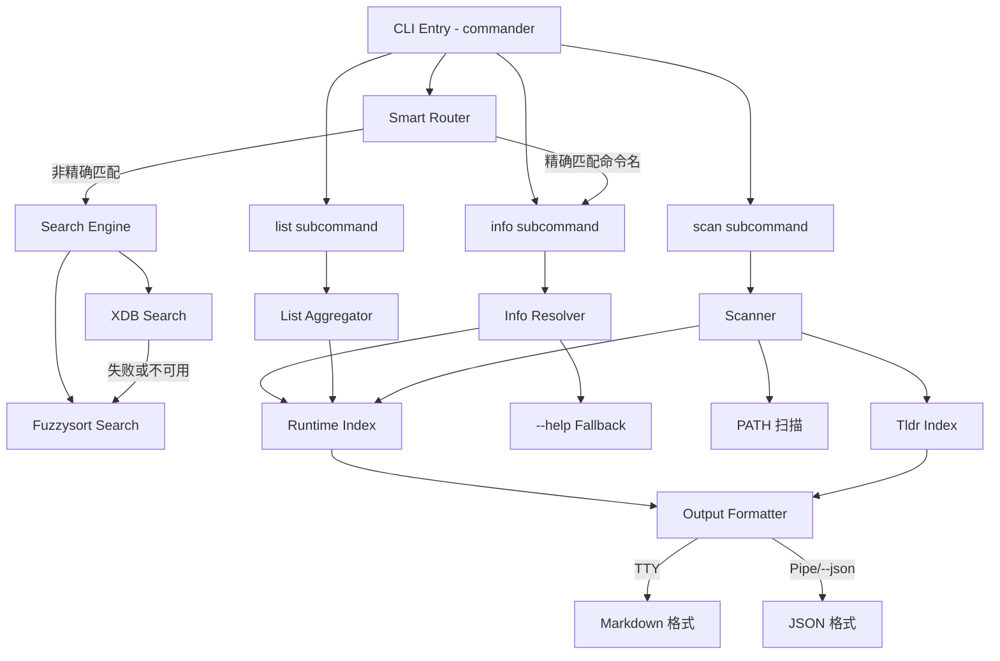

# 设计文档: cmds-cli

## 概述

`cmds` 是一个 Node.js CLI 工具，使用 TypeScript 编写，通过 tsup 构建为 ESM 格式。核心架构采用分层设计：输入解析层 → 智能路由层 → 功能模块层（搜索/信息/列表/扫描）→ 数据层 → 输出格式化层。

工具依赖 commander 进行 CLI 参数解析，fuzzysort 进行模糊匹配，可选依赖外部 `xdb` 命令进行向量检索。数据分为静态 tldr 索引（随包分发）和运行时索引（用户本地生成）两层。

## 架构



### 模块划分

| 模块 | 文件 | 职责 |
|------|------|------|
| CLI Entry | `src/index.ts` | commander 配置、子命令注册、参数解析 |
| Smart Router | `src/router.ts` | 判断 query 是命令名还是搜索意图 |
| Search Engine | `src/search.ts` | XDB 向量检索 + fuzzysort 模糊匹配 |
| Info Resolver | `src/info.ts` | 命令详情查询、--help fallback |
| List Aggregator | `src/list.ts` | 分类汇总、过滤 |
| Scanner | `src/scanner.ts` | 系统命令扫描、索引生成 |
| Output Formatter | `src/formatter.ts` | TTY/JSON 输出切换 |
| Data Layer | `src/data.ts` | 索引加载、读写 |
| Types | `src/types.ts` | 共享类型定义 |
| Utils | `src/utils.ts` | 工具函数（PATH 查找、命令执行等） |

## 组件与接口

### CLI Entry (`src/index.ts`)

使用 commander 注册以下命令结构：

```typescript
// 默认命令（智能路由）
program
  .argument('[query]', '搜索查询或命令名')
  .option('--limit <n>', '返回结果数量', '5')
  .option('--json', 'JSON 格式输出')
  .action(handleDefaultCommand);

// info 子命令
program
  .command('info <command>')
  .option('--json', 'JSON 格式输出')
  .action(handleInfoCommand);

// list 子命令
program
  .command('list')
  .option('--category <type>', '按分类过滤')
  .option('--json', 'JSON 格式输出')
  .action(handleListCommand);

// scan 子命令
program
  .command('scan')
  .option('--json', 'JSON 格式输出')
  .action(handleScanCommand);
```

### Smart Router (`src/router.ts`)

```typescript
interface RouteResult {
  type: 'info' | 'search';
  query: string;
}

function routeQuery(query: string, index: RuntimeIndex): RouteResult;
```

路由逻辑：检查 query 是否精确匹配 Runtime_Index 中的命令名。匹配则路由到 info，否则路由到 search。

### Search Engine (`src/search.ts`)

```typescript
interface SearchResult {
  name: string;
  description: string;
  score: number;
  category: string;
}

async function search(
  query: string,
  index: RuntimeIndex,
  options: { limit: number }
): Promise<SearchResult[]>;

async function searchXdb(query: string, limit: number): Promise<SearchResult[] | null>;
function searchFuzzy(query: string, index: RuntimeIndex, limit: number): SearchResult[];
```

搜索策略：先检查 `index.meta.xdbAvailable`，若为 true 则尝试 XDB 搜索。XDB 调用失败时静默 fallback 到 fuzzysort。fuzzysort 匹配对象为命令的 name + description + examples 拼接文本。

### Info Resolver (`src/info.ts`)

```typescript
interface CommandInfo {
  name: string;
  description: string;
  useCases: string[];
  examples: Array<{ description: string; command: string }>;
  caveats: string[];
}

async function resolveInfo(command: string, index: RuntimeIndex): Promise<CommandInfo>;
async function helpFallback(command: string): Promise<string | null>;
```

查询逻辑：
1. 通过 `which` / PATH 查找确认命令存在
2. 在 Runtime_Index 中查找结构化数据
3. 若索引无数据，执行 `<command> --help` 提取描述
4. 命令不存在则抛出 CommandNotFoundError

### List Aggregator (`src/list.ts`)

```typescript
interface CategorySummary {
  name: string;
  count: number;
  representative: string[];  // 3-5 个代表性命令
}

interface ListSummary {
  totalCategories: number;
  totalCommands: number;
  categories: CategorySummary[];
}

function listSummary(index: RuntimeIndex): ListSummary;
function listByCategory(index: RuntimeIndex, category: string): CommandEntry[];
```

分类体系：`filesystem` / `text-processing` / `search` / `archive` / `process` / `system` / `network` / `shell` / `other`。

### Scanner (`src/scanner.ts`)

```typescript
interface ScanResult {
  commandsFound: number;
  commandsWithTldr: number;
  commandsWithHelp: number;
  xdbAvailable: boolean;
  scanTime: string;
}

async function scan(tldrIndex: TldrIndex): Promise<ScanResult>;
async function detectCommands(): Promise<string[]>;
async function checkXdbAvailability(): Promise<boolean>;
```

扫描流程：
1. `detectCommands()`: 优先 `compgen -c`（bash），fallback 遍历 PATH 目录
2. 与 tldr 索引比对，提取匹配命令的 metadata
3. 对无 tldr 数据的命令尝试 `--help`
4. 检测 XDB 可用性
5. 写入 `~/.config/cmds/index.json`

### Output Formatter (`src/formatter.ts`)

```typescript
type Formattable = SearchResult[] | CommandInfo | ListSummary | CommandEntry[] | ScanResult;

function format(data: Formattable, options: { json: boolean }): string;
function isTTY(): boolean;
function shouldOutputJson(explicitJson: boolean): boolean;

function formatSearchResults(results: SearchResult[]): string;
function formatCommandInfo(info: CommandInfo): string;
function formatListSummary(summary: ListSummary): string;
function formatCategoryList(commands: CommandEntry[]): string;
function formatScanResult(result: ScanResult): string;
```

输出决策：`shouldOutputJson = explicitJson || !isTTY()`。Markdown 格式化使用纯字符串拼接，不依赖外部 Markdown 渲染库。

### Data Layer (`src/data.ts`)

```typescript
async function loadTldrIndex(): Promise<TldrIndex>;
async function loadRuntimeIndex(): Promise<RuntimeIndex | null>;
async function saveRuntimeIndex(index: RuntimeIndex): Promise<void>;
function getRuntimeIndexPath(): string;
function getTldrIndexPath(): string;
```

路径约定：
- Tldr Index: 使用 `import.meta.url` 解析到 `dist/data/tldr-index.json`
- Runtime Index: `~/.config/cmds/index.json`（跨平台使用 `os.homedir()`）

## 数据模型

### Tldr Index Entry

```typescript
interface TldrEntry {
  name: string;
  description: string;
  category: string;
  examples: Array<{
    description: string;
    command: string;
  }>;
  aliases: string[];
  relatedCommands: string[];
  seeAlso: string[];
  tags: string[];
  platforms: string[];
}

type TldrIndex = TldrEntry[];
```

### Runtime Index

```typescript
interface CommandEntry {
  name: string;
  description: string;
  category: string;
  examples: Array<{
    description: string;
    command: string;
  }>;
  source: 'tldr' | 'help' | 'unknown';
  aliases: string[];
  tags: string[];
}

interface RuntimeIndexMeta {
  xdbAvailable: boolean;
  lastScanTime: string;  // ISO 8601
  systemInfo: {
    platform: string;
    arch: string;
    shell: string;
  };
}

interface RuntimeIndex {
  meta: RuntimeIndexMeta;
  commands: CommandEntry[];
}
```

### Search Result

```typescript
interface SearchResult {
  name: string;
  description: string;
  score: number;
  category: string;
}
```

### Command Info (info 子命令输出)

```typescript
interface CommandInfo {
  name: string;
  description: string;
  useCases: string[];
  examples: Array<{
    description: string;
    command: string;
  }>;
  caveats: string[];
}
```

## 正确性属性

*正确性属性（Correctness Property）是一种在系统所有合法执行中都应成立的特征或行为——本质上是对系统应做什么的形式化陈述。属性是连接人类可读规格说明与机器可验证正确性保证的桥梁。*

### Property 1: 智能路由正确性

*For any* query 字符串和 Runtime_Index，`routeQuery` 返回 `'info'` 当且仅当 query 精确匹配 Runtime_Index 中某个命令的 name 字段；否则返回 `'search'`。

**Validates: Requirements 1.1, 1.2**

### Property 2: 搜索结果按相关性排序

*For any* 搜索查询、Runtime_Index 和 limit 参数，`searchFuzzy` 返回的结果列表中，每个元素的 score 应大于等于其后续元素的 score（降序排列）。

**Validates: Requirements 2.1**

### Property 3: 搜索结果数量不超过 limit

*For any* 搜索查询、Runtime_Index 和正整数 limit，`search` 返回的结果数量应小于等于 limit。

**Validates: Requirements 2.2, 2.3**

### Property 4: 模糊搜索匹配范围覆盖 name、description 和 examples

*For any* Runtime_Index 中包含某个命令，若该命令的 name 精确等于搜索查询，则该命令应出现在 `searchFuzzy` 的结果中（limit 足够大时）。

**Validates: Requirements 2.6**

### Property 5: Info 返回完整结构化信息

*For any* 存在于 Runtime_Index 中的命令条目，`resolveInfo` 返回的 CommandInfo 对象应包含非空的 name 和 description 字段，以及 examples 数组。

**Validates: Requirements 3.1**

### Property 6: 分类过滤正确性

*For any* Runtime_Index 和有效的 category 字符串，`listByCategory` 返回的所有命令条目的 category 字段应等于指定的 category。

**Validates: Requirements 4.2**

### Property 7: Summary 概览一致性

*For any* Runtime_Index，`listSummary` 返回的 totalCommands 应等于所有 categories 中 count 的总和，且 totalCategories 应等于 categories 数组的长度。

**Validates: Requirements 4.1**

### Property 8: Tldr 索引比对正确性

*For any* 已检测命令列表和 Tldr_Index，比对结果中的每个命令应满足：若该命令名存在于 Tldr_Index 中，则其 source 为 `'tldr'` 且携带 Tldr_Index 中的 metadata；若不存在于 Tldr_Index 中，则其 source 为 `'help'` 或 `'unknown'`。

**Validates: Requirements 5.2**

### Property 9: Runtime Index 序列化 round-trip

*For any* 合法的 RuntimeIndex 对象（包含 meta.xdbAvailable、meta.lastScanTime、meta.systemInfo 和 commands 数组），序列化为 JSON 后再反序列化应产生等价的对象。

**Validates: Requirements 5.5, 7.4**

### Property 10: 输出格式决策正确性

*For any* boolean 值 explicitJson 和 isTTY，`shouldOutputJson(explicitJson, isTTY)` 返回 true 当且仅当 `explicitJson === true` 或 `isTTY === false`。

**Validates: Requirements 6.1, 6.2, 6.3**

## 错误处理

| 场景 | 处理方式 | 退出码 |
|------|----------|--------|
| 无参数 | 输出帮助信息 | 0 |
| 参数错误 | commander 自动处理，输出用法提示 | 2 |
| 命令未找到（info） | 输出错误信息 "Command not found: <name>" | 1 |
| 搜索无结果 | 输出提示 "No results found for: <query>" | 1 |
| 分类不存在（list） | 输出提示 "Category not found: <type>" | 1 |
| Runtime_Index 不存在 | 提示运行 `cmds scan` | 1 |
| Runtime_Index 损坏 | 提示重新运行 `cmds scan` | 1 |
| Tldr_Index 加载失败 | 输出错误信息并以退出码 1 退出 | 1 |
| XDB 调用失败 | 静默 fallback 到 fuzzysort，不输出错误 | - |
| `--help` fallback 失败 | 返回基本信息（仅 name），不报错 | 0 |

错误输出统一写入 stderr，正常输出写入 stdout。

## 测试策略

### 测试框架

- 单元测试与属性测试: vitest + fast-check
- 每个属性测试至少运行 100 次迭代

### 属性测试（Property-Based Testing）

使用 fast-check 为每个正确性属性编写对应的属性测试：

- **Property 1**: 生成随机 RuntimeIndex 和 query，验证路由决策正确性
- **Property 2**: 生成随机索引和查询，验证结果排序
- **Property 3**: 生成随机索引、查询和 limit，验证结果数量约束
- **Property 4**: 生成随机索引，取其中一个命令名作为查询，验证能被搜索到
- **Property 5**: 生成随机 CommandEntry，验证 resolveInfo 输出结构完整
- **Property 6**: 生成随机索引和 category，验证过滤结果一致性
- **Property 7**: 生成随机索引，验证 summary 数值一致性
- **Property 8**: 生成随机命令列表和 tldr 索引，验证比对逻辑
- **Property 9**: 生成随机 RuntimeIndex，验证 JSON 序列化 round-trip
- **Property 10**: 枚举 explicitJson 和 isTTY 的所有组合，验证决策逻辑

每个属性测试标注格式: `Feature: cmds-cli, Property N: <property_text>`

### 单元测试

单元测试聚焦于：
- 具体示例验证（如 `cmds info find` 的预期输出结构）
- 边界情况（空索引、空查询、不存在的分类）
- 错误条件（命令不存在、索引损坏、XDB 失败 fallback）
- CLI 参数解析集成测试

### 测试文件组织

```
src/
├── __tests__/
│   ├── router.test.ts        # Smart Router 测试
│   ├── search.test.ts        # Search Engine 测试
│   ├── info.test.ts          # Info Resolver 测试
│   ├── list.test.ts          # List Aggregator 测试
│   ├── scanner.test.ts       # Scanner 测试
│   ├── formatter.test.ts     # Output Formatter 测试
│   ├── data.test.ts          # Data Layer 测试
│   └── helpers/
│       └── arbitraries.ts    # fast-check 自定义 Arbitrary 生成器
```
